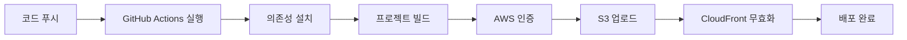

# 🚀 KOLLAB KOREA - 배포 가이드

## 📋 목차
- [GitHub 설정](#github-설정)
- [AWS S3 설정](#aws-s3-설정)
- [첫 배포](#첫-배포)
- [배포 프로세스](#배포-프로세스)
- [트러블슈팅](#트러블슈팅)

---

## 🔧 GitHub 설정

### 1. GitHub Secrets 설정

Repository 설정에서 다음 Secrets를 추가하세요:

**필수 Secrets:**
```
AWS_ACCESS_KEY_ID         = your_aws_access_key
AWS_SECRET_ACCESS_KEY     = your_aws_secret_key
AWS_REGION                = ap-northeast-2 (서울 리전)
S3_BUCKET                 = kollabkorea
```

**선택 Secrets (CloudFront 사용 시):**
```
CLOUDFRONT_DISTRIBUTION_ID = your_distribution_id
```

### 2. Secrets 추가 방법

1. GitHub 저장소 → **Settings** 이동
2. 좌측 메뉴에서 **Secrets and variables** → **Actions** 클릭
3. **New repository secret** 버튼 클릭
4. 각 Secret의 Name과 Value 입력 후 저장

---

## ☁️ AWS S3 설정

### 1. S3 버킷 생성 (이미 완료)
```
버킷 이름: kollabkorea
리전: ap-northeast-2 (서울)
```

### 2. S3 정적 웹사이트 호스팅 활성화

```bash
# AWS CLI로 설정 (선택사항)
aws s3 website s3://kollabkorea/ \
  --index-document index.html \
  --error-document index.html
```

또는 **AWS Console에서:**
1. S3 버킷 → **Properties** 탭
2. **Static website hosting** 섹션 → **Edit**
3. **Enable** 선택
4. Index document: `index.html`
5. Error document: `index.html`
6. **Save changes**

### 3. S3 버킷 정책 설정 (공개 읽기 권한)

```json
{
  "Version": "2012-10-17",
  "Statement": [
    {
      "Sid": "PublicReadGetObject",
      "Effect": "Allow",
      "Principal": "*",
      "Action": "s3:GetObject",
      "Resource": "arn:aws:s3:::kollabkorea/*"
    }
  ]
}
```

**적용 방법:**
1. S3 버킷 → **Permissions** 탭
2. **Bucket Policy** → **Edit**
3. 위 JSON 붙여넣기
4. **Save changes**

### 4. CORS 설정 (필요시)

```json
[
  {
    "AllowedHeaders": ["*"],
    "AllowedMethods": ["GET", "HEAD"],
    "AllowedOrigins": ["*"],
    "ExposeHeaders": []
  }
]
```

---

## 🎯 첫 배포

### 1. Git 초기화 및 원격 저장소 연결

```bash
# 1. Git 초기화 (아직 안했다면)
git init

# 2. 원격 저장소 추가
git remote add origin https://github.com/yigolabdev/kollabkorea.git

# 3. 현재 브랜치 이름 확인/변경
git branch -M main

# 4. 파일 스테이징
git add .

# 5. 첫 커밋
git commit -m "feat: KOLLAB KOREA 랜딩페이지 초기 배포

- React 18 + TypeScript + Vite 스택
- Tailwind CSS 디자인 시스템
- 8개 섹션 (Hero, About, Benefits, Zones, Mood, Partners, CTA, Footer)
- 반응형 디자인 (모바일/태블릿/데스크톱)
- 입점 신청 모달 기능
- GitHub Actions CI/CD 파이프라인
- AWS S3 자동 배포 설정"

# 6. 원격 저장소로 푸시
git push -u origin main
```

### 2. 배포 확인

푸시 후 자동으로 배포가 시작됩니다:

1. **GitHub Actions 확인**
   - GitHub 저장소 → **Actions** 탭
   - "Deploy to AWS S3" 워크플로우 실행 확인

2. **배포 완료 후 접속**
   ```
   http://kollabkorea.s3-website.ap-northeast-2.amazonaws.com
   ```

---

## 🔄 배포 프로세스

### 자동 배포 트리거

```bash
# main 브랜치에 푸시하면 자동 배포
git add .
git commit -m "feat: 새로운 기능 추가"
git push origin main
```

### 수동 배포 (GitHub Actions)

1. GitHub 저장소 → **Actions** 탭
2. **Deploy to AWS S3** 워크플로우 선택
3. **Run workflow** 버튼 클릭
4. 브랜치 선택 후 **Run workflow** 실행

### 배포 단계



1. **코드 체크아웃**
2. **Node.js 18 설정**
3. **npm ci로 의존성 설치**
4. **npm run build로 프로덕션 빌드**
5. **AWS 자격증명 구성**
6. **dist/ 폴더를 S3에 동기화**
7. **index.html 캐시 비활성화**
8. **CloudFront 무효화 (선택)**

---

## 🛠 로컬 빌드 테스트

배포 전 로컬에서 빌드 테스트:

```bash
# 1. 빌드
npm run build

# 2. 빌드 결과 미리보기
npm run preview

# 3. 브라우저에서 확인
# http://localhost:4173
```

---

## 🎨 커스텀 도메인 연결 (선택사항)

### 1. Route 53에서 도메인 설정

```bash
# 예: www.kollabkorea.com
```

### 2. CloudFront 배포 생성

1. **Origins:**
   - Origin Domain: `kollabkorea.s3-website.ap-northeast-2.amazonaws.com`
   - Protocol: HTTP only

2. **Default Cache Behavior:**
   - Viewer Protocol Policy: Redirect HTTP to HTTPS
   - Cache Policy: Managed-CachingOptimized

3. **Settings:**
   - Alternate Domain Names (CNAMEs): `www.kollabkorea.com`
   - SSL Certificate: Request ACM certificate

### 3. Route 53 레코드 추가

```
Type: A (Alias)
Name: www.kollabkorea.com
Value: [CloudFront Distribution]
```

---

## 📊 배포 모니터링

### GitHub Actions 로그 확인

```bash
# GitHub 저장소 → Actions 탭
# 각 워크플로우 실행을 클릭하여 상세 로그 확인
```

### S3 배포 확인

```bash
# AWS CLI로 S3 버킷 내용 확인
aws s3 ls s3://kollabkorea/ --recursive

# 최근 업로드된 파일 확인
aws s3 ls s3://kollabkorea/ --recursive --human-readable --summarize
```

---

## 🐛 트러블슈팅

### 1. 빌드 실패

**문제:** `npm run build` 실패
```bash
# 로컬에서 확인
npm run build

# 린트 에러 확인
npm run build
```

### 2. AWS 자격증명 오류

**문제:** `Error: Credentials not set`
**해결:**
- GitHub Secrets 확인
  - `AWS_ACCESS_KEY_ID`
  - `AWS_SECRET_ACCESS_KEY`
  - `AWS_REGION`
  - `S3_BUCKET`

### 3. S3 업로드 권한 오류

**문제:** `AccessDenied: User is not authorized`
**해결:**
- IAM 사용자에 다음 권한 추가:
  ```json
  {
    "Version": "2012-10-17",
    "Statement": [
      {
        "Effect": "Allow",
        "Action": [
          "s3:PutObject",
          "s3:PutObjectAcl",
          "s3:GetObject",
          "s3:DeleteObject",
          "s3:ListBucket"
        ],
        "Resource": [
          "arn:aws:s3:::kollabkorea",
          "arn:aws:s3:::kollabkorea/*"
        ]
      }
    ]
  }
  ```

### 4. 404 에러 (페이지 새로고침 시)

**문제:** SPA 라우팅 시 404 에러
**해결:**
- S3 Error document를 `index.html`로 설정
- 또는 CloudFront에서 Custom Error Response 설정:
  - HTTP Error Code: 403, 404
  - Response Page Path: `/index.html`
  - HTTP Response Code: 200

### 5. 캐시 문제

**문제:** 배포 후에도 이전 버전이 보임
**해결:**
```bash
# CloudFront 캐시 무효화
aws cloudfront create-invalidation \
  --distribution-id YOUR_DISTRIBUTION_ID \
  --paths "/*"

# 브라우저 캐시 강제 새로고침
Ctrl + Shift + R (Windows/Linux)
Cmd + Shift + R (Mac)
```

---

## 🚀 빠른 배포 명령어

```bash
# 1단계: 코드 변경 후 스테이징
git add .

# 2단계: 커밋 (의미있는 메시지 작성)
git commit -m "feat: 새로운 기능 추가"

# 3단계: 푸시 → 자동 배포 시작!
git push origin main

# 4단계: GitHub Actions에서 배포 상태 확인
# https://github.com/yigolabdev/kollabkorea/actions

# 5단계: 배포 완료 후 사이트 확인
# http://kollabkorea.s3-website.ap-northeast-2.amazonaws.com
```

---

## 📝 배포 체크리스트

배포 전 확인사항:

- [ ] 로컬 빌드 성공 (`npm run build`)
- [ ] 로컬 프리뷰 확인 (`npm run preview`)
- [ ] 린트 에러 없음
- [ ] 반응형 테스트 완료 (모바일/태블릿/데스크톱)
- [ ] 브라우저 호환성 테스트
- [ ] 접근성 테스트
- [ ] 메타 태그 확인 (SEO)
- [ ] 이미지 최적화
- [ ] 성능 테스트 (Lighthouse)

배포 후 확인사항:

- [ ] 메인 페이지 로딩 확인
- [ ] 모든 섹션 정상 표시
- [ ] 네비게이션 링크 작동
- [ ] 모달 기능 정상
- [ ] 폼 제출 테스트
- [ ] 반응형 동작 확인
- [ ] 애니메이션 정상 작동

---

## 🔗 유용한 링크

- **GitHub Repository:** https://github.com/yigolabdev/kollabkorea
- **GitHub Actions:** https://github.com/yigolabdev/kollabkorea/actions
- **AWS S3 Console:** https://s3.console.aws.amazon.com/s3/buckets/kollabkorea
- **Site URL:** http://kollabkorea.s3-website.ap-northeast-2.amazonaws.com

---

## 📧 문의

배포 관련 문제가 있으시면:
- **Email:** info@kollabkorea.com
- **Instagram:** [@kollab_korea](https://instagram.com/kollab_korea)

---

<div align="center">
  <strong>Happy Deploying! 🚀</strong>
</div>

