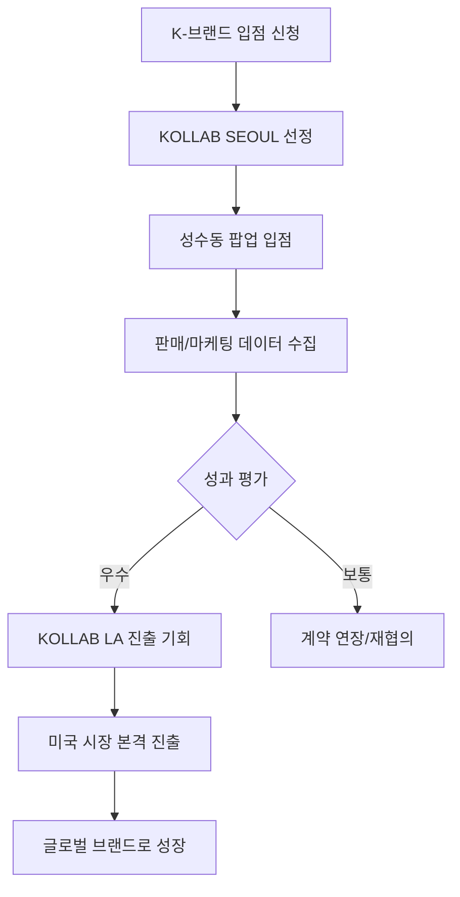

# 📊 KOLLAB KOREA - 프로젝트 개요 및 목적

<div align="center">
  <h2>WHERE SEOUL MEETS LA</h2>
  <p><strong>K-브랜드의 미국 진출, 첫걸음을 함께합니다</strong></p>
</div>

---

## 🎯 프로젝트 핵심 목적

### 메인 목적
> **K-브랜드의 미국 시장 진출을 가장 전략적으로 시작할 수 있는 첫 단계**

KOLLAB KOREA는 단순한 팝업 스토어가 아닌, **K-브랜드의 글로벌 확장을 위한 전략적 테스트베드**입니다.

---

## 🏢 비즈니스 모델

### 1. **Seoul (성수동) 팝업 스토어** 
```
📍 위치: 서울 성수동
🎨 콘셉트: 인더스트리얼 × 프리미엄
📅 운영: 현재 오픈 (10:00-20:00)
🎪 형태: POP-UP & EXHIBITION
```

**목적:**
- K-브랜드 30개 큐레이션 전시/판매
- 성수동의 트렌디한 이미지 활용
- 브랜드 테스트 마켓으로 활용
- 콘텐츠 제작 (사진/릴스)

### 2. **LA 확장 계획**
```
📍 위치: Los Angeles, Downtown
🎨 콘셉트: Global Flagship Store
📅 오픈: 2025년 8월 예정
🎪 형태: 상설 리테일 스토어
```

**목적:**
- 성공적인 브랜드를 LA로 확장
- 미국 시장 본격 진출 지원
- 글로벌 유통 네트워크 연결

---

## 🎪 30개 브랜드 입점 구조

### Zone 구성

| Zone | 브랜드 수 | 특징 | 타겟 브랜드 |
|------|-----------|------|-------------|
| **PREMIUM** | 4개 | 포토존 전면 최고 노출 | 글로벌/디자이너 브랜드 |
| **STANDARD** | 6개 | 메인 중앙 모듈존 | KOLLAB 핵심 브랜드 |
| **BASIC** | 20개 | 2주 회전 시스템 | 신생/테스트 브랜드 |
| **합계** | **30개** | | |

### Zone별 혜택

#### Premium Zone (4개)
- ✅ 가장 높은 노출 (포토존 인근 전면)
- ✅ 1개월 또는 3개월 계약
- ✅ 현장 릴스 영상 제공
- ✅ 글로벌·디자이너 브랜드 우선

#### Standard Zone (6개)
- ✅ 메인 중앙 모듈존 배치
- ✅ 카테고리별 체계적 구성
- ✅ KOLLAB SEOUL의 핵심 존
- ✅ 현장 릴스 영상 제공

#### Basic Zone (20개)
- ✅ 벽면 선반형 진열
- ✅ 2주 단위 회전 시스템
- ✅ 신생 브랜드 테스트 최적화
- ✅ 효율적인 공간 활용

---

## 💎 브랜드 입점 6대 혜택

### 1. **글로벌 감성 포지셔닝**
```
✓ LA × SEOUL 프리미엄 셀렉트 스토어 입점
✓ 브랜드 이미지 상승 및 라이프스타일 포지셔닝 강화
```

### 2. **브랜드 콘텐츠 제공**
```
✓ 현장 촬영 사진 1컷 제공
✓ Premium/Standard는 현장 릴스영상 포함
```

### 3. **글로벌 확장 기회**
```
✓ 판매 성과 우수 브랜드 → KOLLAB LA 입점 기회
✓ KOLLAB LA 리테일 스토어 연계
```

### 4. **멀티 브랜드 시너지**
```
✓ 총 30개 브랜드 입점 예정
✓ 교차 구매 및 체류시간 증가로 매출 상승
```

### 5. **판매 데이터 리포트**
```
✓ 인기 SKU 및 판매 추이 분석 제공
✓ 소비자 반응 인사이트 공유
```

### 6. **운영 부담 ZERO**
```
✓ 매장 운영 100% KOLLAB SEOUL 관리
✓ 제품만 납품하면 즉시 운영 가능
```

---

## 🎯 타겟 브랜드 카테고리

### 입점 가능 분야
1. **Beauty** (Skincare/Makeup)
2. **Fashion** (의류/액세서리)
3. **Food & Beverage** (식음료)
4. **Lifestyle/Goods** (라이프스타일 제품)
5. **Other** (기타)

---

## 🔍 브랜드 선정 기준 (3대 요소)

### 1. **Unique Identity** (독창적 아이덴티티)
```
✓ 독창적인 디자인: 미국 시장에서도 눈에 띄는 패키지
✓ 명확한 타겟: 팬덤을 형성할 수 있는 스토리텔링
```

### 2. **Product Power** (제품 경쟁력)
```
✓ 차별화된 성분: 효능이 입증된 핵심 원료 사용
✓ 검증된 품질: 임상 데이터 및 인증 보유 권장
```

### 3. **Global Vision** (글로벌 비전)
```
✓ 적극적 협업: 마케팅 캠페인에 대한 참여 의지
✓ 수출 준비성: 해외 판매에 결격 사유가 없는 제품
```

---

## 🎨 브랜드 콘셉트

### Seoul × LA
```
🏙️ Seoul (성수동)
- 인더스트리얼한 감성
- K-뷰티/K-패션의 메카
- 트렌드를 선도하는 도시

✈️ Meets

🌴 Los Angeles
- 자유로운 라이프스타일
- 글로벌 트렌드의 중심
- 다양성과 혁신의 도시
```

### 디자인 철학
- **Bold & Industrial**: 강렬하고 인더스트리얼한 감성
- **Premium Selection**: 엄선된 30개 브랜드만
- **Global Vision**: 성공하면 LA로 확장
- **Partnership**: 브랜드와 함께 성장

---

## 📈 비즈니스 플로우



### 단계별 설명

**Step 1: 입점 신청**
- 웹사이트를 통해 브랜드 정보 제출
- 카테고리, 브랜드 스토리, 제품 정보

**Step 2: 선정 심사**
- Unique Identity 검토
- Product Power 평가
- Global Vision 확인

**Step 3: 성수동 팝업 입점**
- Zone 배정 (Premium/Standard/Basic)
- 제품 진열 및 판매 시작
- 브랜드 콘텐츠 촬영

**Step 4: 데이터 수집 & 분석**
- 판매 SKU 데이터
- 고객 반응 분석
- 체류 시간 및 교차 구매 패턴

**Step 5: 성과 평가**
- 우수 브랜드 → LA 진출 기회
- 일반 브랜드 → 계약 연장 또는 Basic Zone으로 이동

**Step 6: LA 확장**
- KOLLAB LA 리테일 스토어 입점
- 미국 유통 네트워크 연결
- 글로벌 브랜드로 성장

---

## 🎯 사이트의 목적

### 이 웹사이트는:

1. **브랜드 입점 신청 창구**
   - 입점 희망 브랜드의 정보 수집
   - 카테고리, 연락처, 브랜드 소개

2. **KOLLAB 소개**
   - Seoul × LA 콘셉트 전달
   - 성수동 팝업 스토어 위치
   - LA 확장 계획 공개

3. **혜택 안내**
   - 6가지 입점 혜택 상세 설명
   - 브랜드 콘텐츠 제공
   - LA 진출 기회

4. **Zone 설명**
   - Premium/Standard/Basic 차이
   - 각 Zone별 특징과 혜택
   - 매장 맵 시각화

5. **브랜드 선정 기준**
   - 3가지 선정 요소 설명
   - 명확한 기대치 설정
   - 신뢰감 형성

6. **행동 유도 (CTA)**
   - "Ready To Go Global?" 메시지
   - 입점 신청 모달
   - 즉시 문의 가능

---

## 🎪 이벤트 콘셉트 (추정)

파일명 "Kollab 1st pop up event 기획안"을 바탕으로:

### 1st Pop-up Event
```
🎉 이벤트: KOLLAB SEOUL 첫 팝업 이벤트
📍 장소: 서울 성수동
🎯 목적: 30개 브랜드 론칭 및 홍보
📸 콘텐츠: 인스타그래머블한 공간 구성
🎁 혜택: 오픈 기념 특별 혜택
```

### 예상 이벤트 구성
- **그랜드 오픈**: 언론 및 인플루언서 초청
- **포토존**: 인스타그램 콘텐츠 제작 공간
- **브랜드 부스**: 30개 브랜드 체험/구매
- **특별 프로모션**: 오픈 기념 할인/증정
- **네트워킹**: 브랜드 간 교류 및 협업 기회

---

## 💼 수익 모델 (추정)

### 브랜드로부터
1. **입점료**
   - Premium Zone: 높은 입점료
   - Standard Zone: 중간 입점료
   - Basic Zone: 낮은 입점료 또는 수수료

2. **판매 수수료**
   - 판매액의 일정 비율

3. **콘텐츠 제작비**
   - 추가 촬영/영상 제작 시

### 소비자로부터
1. **제품 판매**
   - 30개 브랜드 제품 판매
   - 교차 구매로 객단가 증가

2. **입장료** (선택)
   - 팝업 이벤트 시

---

## 🎯 타겟 오디언스

### Primary (입점 브랜드)
```
👔 대표/마케터
- K-브랜드 대표 및 담당자
- 미국 진출 희망 브랜드
- Beauty, Fashion, Food, Lifestyle

🎯 니즈:
- 미국 시장 테스트 기회
- 글로벌 포지셔닝
- 비용 효율적인 진출 방법
- 판매 데이터 및 인사이트
```

### Secondary (소비자)
```
🛍️ 방문객
- 20-40대 얼리어답터
- K-브랜드에 관심 있는 소비자
- 성수동 방문객
- 인스타그래머블한 공간 선호

🎯 니즈:
- 새로운 K-브랜드 발견
- 프리미엄 쇼핑 경험
- SNS 콘텐츠 제작
- 큐레이션된 브랜드
```

---

## 📊 성공 지표 (KPI)

### 브랜드 측면
- ✅ 30개 브랜드 입점 완료
- ✅ Premium/Standard Zone 조기 마감
- ✅ 브랜드 만족도 80% 이상
- ✅ LA 진출 브랜드 3개 이상

### 매출 측면
- ✅ 월 매출 목표 달성
- ✅ 객단가 증가
- ✅ 재방문율 40% 이상

### 마케팅 측면
- ✅ SNS 노출 1M 이상
- ✅ 언론 보도 10건 이상
- ✅ 인플루언서 방문 50명 이상

---

## 🚀 향후 계획

### 단기 (3개월)
- ✅ 30개 브랜드 입점 완료
- ✅ 성수동 팝업 안정화
- ✅ 판매 데이터 수집

### 중기 (6개월)
- ✅ 우수 브랜드 선별
- ✅ LA 진출 준비
- ✅ 브랜드 회전 시스템 확립

### 장기 (1년)
- ✅ KOLLAB LA 오픈 (2025년 8월)
- ✅ 글로벌 유통 네트워크 구축
- ✅ 추가 도시 확장 검토

---

## 💡 사이트 개선 제안

현재 사이트는 목적에 잘 부합하지만, 다음을 추가하면 더 좋습니다:

### 1. **성공 사례 (Case Study)**
```
섹션 추가: "Success Stories"
- 입점 후 성공한 브랜드 사례
- 판매 증가율, LA 진출 사례
- 브랜드 대표 인터뷰
```

### 2. **FAQ 섹션**
```
자주 묻는 질문:
- 입점 비용은 어떻게 되나요?
- 계약 기간은 얼마나 되나요?
- LA 진출 기준은 무엇인가요?
- 매장 운영은 어떻게 하나요?
```

### 3. **타임라인**
```
KOLLAB 로드맵:
2024년 하반기: SEOUL 오픈
2025년 상반기: 브랜드 확대
2025년 8월: LA 오픈
2025년 하반기: 글로벌 확장
```

### 4. **실시간 데이터**
```
- 현재 입점 브랜드 수: 23/30
- 남은 Premium Zone: 1/4
- 다음 Basic Zone 회전: D-5
```

---

## 📞 연락처

- **Email**: info@kollabkorea.com
- **Instagram**: [@kollab_korea](https://instagram.com/kollab_korea)
- **Business Hours**: 10:00 - 20:00 (KST)
- **Location**: 서울 성수동 (정확한 주소 추가 필요)

---

<div align="center">
  <h2>🎨 WHERE SEOUL MEETS LA</h2>
  <p><strong>K-브랜드의 글로벌 첫걸음, KOLLAB과 함께</strong></p>
  <p>© 2025 KOLLAB KOREA. All Rights Reserved.</p>
</div>

